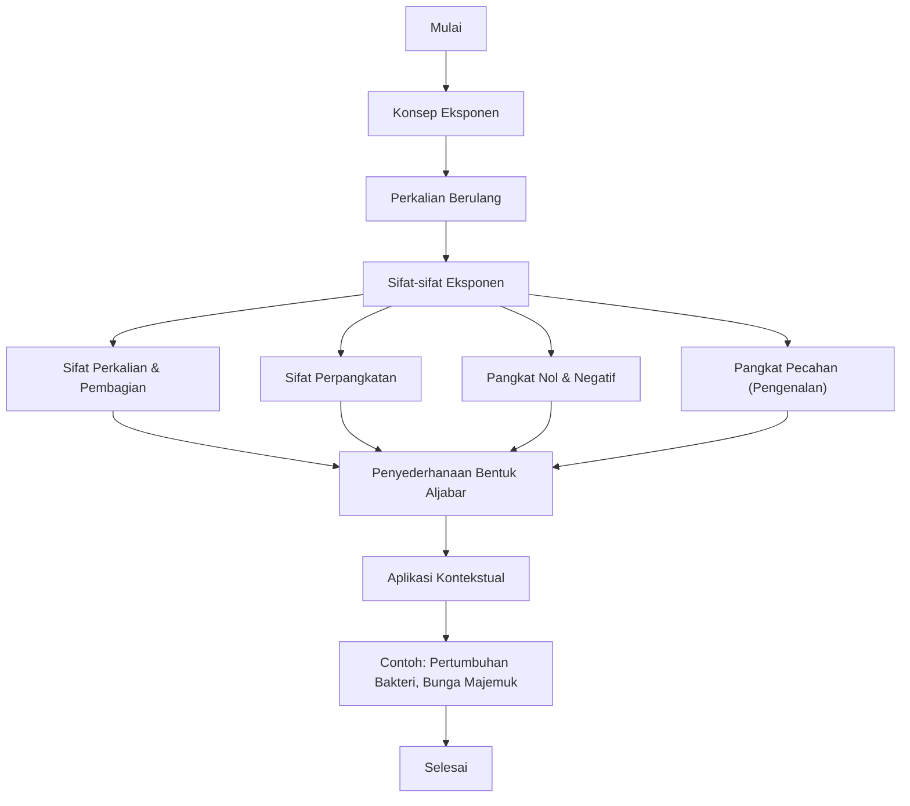

# Bilangan Berpangkat (Eksponen)

**Mata Pelajaran:** Matematika
**Fase/Kelas:** E / X
**Nama Materi:** Bilangan Berpangkat (Eksponen)

**Tujuan Unit Pembelajaran**  

Selamat datang di petualangan matematika kelas X\! Di unit pertama ini, kita akan menjelajahi salah satu konsep paling kuat dalam matematika: **Eksponen**. Setelah mempelajari unit ini, kalian diharapkan dapat menjelaskan konsep bilangan berpangkat, mengenali dan menggunakan sifat-sifatnya untuk menyederhanakan bentuk perhitungan, hingga menyelesaikan masalah sehari-hari yang berkaitan dengan pertumbuhan atau peluruhan.

**Peta Konsep**  

Berikut adalah alur materi yang akan kita pelajari bersama di unit ini:

**Apersepsi: Seberapa Cepat Kabar Menyebar?**

Pernahkah kalian berada di pasar atau warung kopi di desa kita? Bayangkan ada satu kabar menarik. Pak Budi menceritakannya kepada 2 orang tetangganya saat pagi hari. Satu jam kemudian, 2 orang tetangganya itu masing-masing menceritakan lagi kepada 2 orang lainnya. Satu jam berikutnya, proses yang sama terulang lagi.

Kira-kira, berapa banyak orang yang akan mendengar kabar itu setelah 3 jam?

Pola penyebaran kabar yang berlipat ganda inilah yang menjadi dasar dari konsep **eksponen** atau **bilangan berpangkat**. Konsep ini tidak hanya untuk menyebarkan kabar, tapi juga digunakan oleh para ilmuwan untuk menghitung pertumbuhan bakteri, oleh ahli ekonomi untuk menghitung bunga di bank, bahkan oleh insinyur untuk merancang bangunan. Mari kita selami lebih dalam\!

**Materi Pembelajaran**  

**1. Apa itu Bilangan Berpangkat (Eksponen)?**

Pada dasarnya, eksponen adalah cara penulisan yang lebih singkat untuk **perkalian berulang**.

Misalnya, kita ingin mengalikan angka 3 sebanyak 4 kali:  

$$3\times3\times3\times3$$

Tentu akan memakan tempat jika angkanya sangat banyak. Nah, kita bisa menyingkatnya menjadi:  

$$3^4$$  

Ini dibaca "tiga pangkat empat".

Dalam bentuk $a^n$:

* **a** disebut **basis** atau bilangan pokok.
* **n** disebut **eksponen** atau pangkat.

Jadi, $3^4$ artinya angka 3 (basis) dikalikan secara berulang sebanyak 4 kali (pangkat).

`#sisipkan diagram yang menunjukkan 2^3 sebagai 2 x 2 x 2 dengan ilustrasi kubus.`

## **2. Sifat-sifat Eksponen**

Untuk mempermudah perhitungan yang melibatkan bilangan berpangkat, ada beberapa sifat yang perlu kita kenali. Anggap saja ini adalah "jalan pintas" yang sah dalam matematika.

| Nama Sifat | Rumus | Contoh Sederhana |
| :--- | :--- | :--- |
| **Perkalian** | $a^m \times a^n = a^{m+n}$ | $2^3 \times 2^2 = 2^{3+2} = 2^5 = 32$ |
| **Pembagian** | $a^m \div a^n = a^{m-n}$ | $5^4 \div 5^2 = 5^{4-2} = 5^2 = 25$ |
| **Perpangkatan** | $(a^m)^n = a^{m \times n}$ | $(4^2)^3 = 4^{2 \times 3} = 4^6 = 4096$ |
| **Distribusi Pangkat (Perkalian)** | $(a \times b)^n = a^n \times b^n$ | $(2 \times 3)^2 = 2^2 \times 3^2 = 4 \times 9 = 36$ |
| **Distribusi Pangkat (Pembagian)** | $(\frac{a}{b})^n = \frac{a^n}{b^n}$ | $(\frac{4}{2})^3 = \frac{4^3}{2^3} = \frac{64}{8} = 8$ |
| **Pangkat Nol** | $a^0 = 1$ (untuk $a \neq 0$) | $1.000.000^0 = 1$ |
| **Pangkat Negatif** | $a^{-n} = \frac{1}{a^n}$ | $2^{-3} = \frac{1}{2^3} = \frac{1}{8}$ |

-----

**Refleksi Pemahaman**  

Mari kita uji pemahaman kalian dengan soal yang lebih menantang. Pilihlah jawaban yang paling tepat\!

1. Bentuk sederhana dari $\frac{27^2 \times 3^5}{81^3}$ adalah...

a. $3^1$  
b. $3^{-1}$  
c. $3^2$
d. $3^{-2}$  
e. $3^0$  

2. Jika $x=2$ dan $y=3$, maka nilai dari $(x^2y^{-3})^{-2}$ adalah...  
a. $\frac{729}{16}$  
b. $\frac{16}{729}$  
c. $\frac{64}{81}$  
d. $\frac{81}{64}$  
e. $\frac{9}{4}$

3. Hasil dari $5^3 + 5^3 + 5^3 + 5^3 + 5^3$ adalah...

a. $5^{15}$  
b. $25^3$  
c. $5^4$  
d. $5^8$  
e. $125^5$  

4. Bentuk $\left(\frac{p^3 q^{-2}}{p^{-1} q^4}\right)^2$ dapat disederhanakan menjadi...  

a. $p^4 q^{-12}$  
b. $p^8 q^{-12}$  
c. $p^8 q^{4}$  
d. $p^4 q^{-4}$  
e. $p^2 q^{-6}$  

5. Jika diketahui $3^{x-1} = 243$, maka nilai $x$ yang memenuhi adalah...

a. 4  
b. 5  
c. 6  
d. 7  
e. 8
   
**Asesmen Formatif**  

Kerjakan soal-soal berikut dengan singkat dan jelas di buku latihanmu\!

1. Sederhanakan bentuk berikut menggunakan sifat-sifat eksponen: $\frac{(x^5 y^2)^3}{x^7 y^2}$
2. Sebuah jenis bakteri membelah diri menjadi dua setiap 10 menit. Jika pada pukul 08.00 ada sebanyak 50 bakteri, berapa jumlah bakteri pada pukul 09.00? (Tuliskan jawabanmu dalam bentuk bilangan berpangkat).
3. Tentukan nilai $n$ jika $2^n = 128$.

**Lampiran**  

**Glosarium**  

* **Basis:** Bilangan pokok yang dipangkatkan dalam suatu notasi eksponen.
* **Eksponen:** Angka yang menunjukkan berapa kali basis dikalikan dengan dirinya sendiri; disebut juga pangkat.
* **Bilangan Berpangkat:** Bilangan yang dinyatakan dalam bentuk $a^n$, yang terdiri dari basis dan eksponen.

**Daftar Pustaka**  

* Kemendikbudristek. (2021). *Matematika untuk SMA/SMK Kelas X*. Jakarta: Pusat Kurikulum dan Perbukuan.
* Kanginan, M. (2016). *Matematika untuk Kelas X SMA*. Jakarta: Erlangga.

